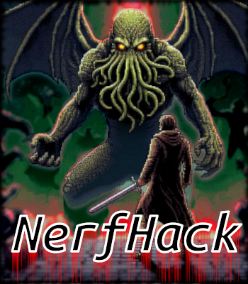

# NerfHack

Welcome, traveler, to NerfHack!

---
**NerfHack** is the successor to **Hack'EM**, which was a modernized variant of **SLASH'EM** based on **EvilHack**. Unlike Hack'EM, **NerfHack** starts fresh from **NetHack 3.7.0** and is designed to be a significantly more challenging variant than Vanilla NetHack. While it incorporates many features and mechanics from Hack'EM, it is *not* a full port, introducing numerous new changes in both content and design. By drawing inspiration from various NetHack variants and carefully fine-tuning different aspects of gameplay, key pain points have been identified and addressed to refine the difficulty curve - resulting in a more treacherous and rewarding dungeon.

## Main goals and ideas for NerfHack:

### Usurp assumptions and approaches to the game

Some of the changes in NerfHack are controversial and challenge decades-old assumptions held by a passionate user-base. This variant will pose pertinent philosophical questions:

**What is fairness in a game that was designed around unfairness?**

- NetHack is known for its brutal difficulty, but it also provides powerful tools and exploits to mitigate this. By nerfing these exploits, does NerfHack make the game fairer, or does it simply shift the balance of unfairness?

**Do players "deserve" to win, or must victory always be earned?**

- Traditional NetHack allows for lucky breaks, powerful item combos, and even near-invincibility through knowledge and exploitation. NerfHack asks whether true mastery should require overcoming even those advantages.

**Is knowledge still power if its applications are restricted?**

- Many of NetHack's challenges can be bypassed through deep game knowledge - like using price identification, alchemy abuse, or resource farming of some sort. If those tools are weakened, does the game reward a different kind of knowledge, or does it simply punish players more?

**What does "difficulty" mean in a game with near-infinite possibilities?**

- By removing exploits, NerfHack raises questions about what constitutes a fair challenge. Is difficulty about strategic depth, resource scarcity, or raw randomness?

**Is a game still fun if it removes "broken" mechanics?**

- Some players enjoy NetHack precisely because of the wild, overpowered strategies they can discover and use. By taking those away, does NerfHack enhance the experience or simply make it more frustrating?

## **NerfHack Design Goals**

### **Discourage and Prevent Degenerate Behavior**
Players should *play the game* and play around the game's *core mechanics*, not just exploit unintended side effects. Strategies that trivialize gameplay through excessive farming, grinding, or repetitive abuse of loopholes are discouraged or removed.

**Examples of discouraged behaviors:**
- **Altar camping** – Preventing infinite sacrifice grinding for artifacts.
- **Farming exploits** – Nerfing tactics like vault guard farming, quest monster farming, and werefoo farming.
- **Polypiling abuse** – Limiting big-pile polypiling to reduce overpowered item generation.
- **Wraith luring** – Preventing excessive level farming by luring wraiths to controlled environments.

**Here are some general guidelines as to what qualifies for nerfing:**
* Is it an infinite or unbounded resource?
* Does it encourage repetitive or mindless farming?
* Does it encourage tedious or time-consuming gameplay?
* Is the exploit the result of unintended or broken mechanics?
* Does the exploit allow the player to bypass core mechanics of the game or dungeon design?
* Does the exploit dissuade the player from interacting or advancing deeper into the dungeon?
* Is it an overwhelmingly effective strategy, making all other options seem trivial in comparison?

---

### **Encourage Exciting and Creative Gameplay**
By nerfing or limiting dominant strategies, players are encouraged to think outside the box and adapt in novel ways. The best players will be those who can creatively solve problems rather than rely on rote strategies.

**Examples of nerfed mechanics that encourage adaptation:**
- **Pet Theft** – Without the option to loot shops or credit clone with a pet, players will have to earn their own gold or steal by brute-force.
- **Astral Rain** – By limiting high-level pets, players will have to contend with the last level without a horde of purple worms to do their bidding. Some foes also spawn with rings of slow digestion or teleport control, adding more uncertainty to the fight.
- **Unicorn Horns** – Less reliable unihorns may force the player to use other items, like potions of healing or milk, to cure their maladies. They can also choose to invest enchantment into their unicorn horn for a more reliable source of healing.
- **Price Identification** – Without the tedious activity of price identification, players will have to find more novel ways of identifying items or embrace the uncertainty of use-testing.

---

### **Give Value to Underutilized Features**
Many items and mechanics in *NetHack* are underused due to stronger alternatives. *NerfHack* aims to breathe new life into these features by making them more viable or rewarding in the right situations.

**Examples:**
- **Invisibility and displacement** both provide more protection against gaze attacks (and there are many new threats with gazes in NerfHack)
- **Polearms** now grant an AC bonus and can be used to disarm traps. They are also more effective versus horses and centaurs.
- **Sources of ESP** become more valuable because of the absence of easily attainable intrinsic telepathy.
- **Sources of warning** become more valuable with the nerfing of intrinsic telepathy gain.
- **Sources of see invisible** become quite useful because of the lack of attainable intrinsic see invisible.
- **Gem alchemy** adds value and utility to both potions of acid and valuable gems.

---

### **Create Meaningful Resource Scarcity**
Players should always feel that their resources are valuable and must be managed wisely. Excessive resources are quelled in many ways.

**Ways scarcity is enforced:**
- **No wishes** – Wishes from all sources have been completely removed, magic lamps are now magic candles.
- **Item destruction and erosion** – More environmental hazards that can destroy or degrade items.
- **Finite altars** – Altars only grant a single artifact gift and then become cracked.
- **AC scaling** – Making dramatically high armor optimization less attainable.
- **Tighter control over HP and healing** – Reducing the ability to gorge maximum HP with alchemy.
- **Donated gold vanishes** – Reducing the supply of gold in the dungeon, adding more value to gold.
- **Gifted gems vanish** – Similar the above change - creating more value in gems because of scarcity.
- **Less guaranteed death drops** – In specific cases, some monsters drop items less frequently.

---

### **Introduce New Threats**
Players should always be on their toes. New threats are designed to add challenge, unpredictability, and danger at all stages of the game.

**Examples:**
- **An expanded bestiary** – Interesting monsters all over the NetHack variant community have been ported in or created from scratch to challenge adventurers.
- **New monster behaviors** – Existing monsters gain new abilities and AI tweaks.
- **Expanded spellcaster spells** – More enemy spellcasters with powerful effects in both clerical and mage spells.
- **New traps** – Additional environmental hazards and surprises like the infamous grease trap!
- **More dangerous impairments** – Effects like fumbling and glibness now have deadlier consequences. "Never be burdened" should be your new maxim for survival.
- **Cursed items are worse** – More severe downsides for equipping cursed gear carelessly.
- **Cthulhu is a major endgame boss** and awaits the player in Moloch's Sanctum. Cthulhu has received many buffs and will even resurrect to haunt the player much like the Wizard of Yendor.

---

### **Smooth Out Dramatic Power Spikes**
Player progression should feel more balanced, preventing sudden jumps in power that trivialize later stages of the game.

**How power progression is balanced:**
- **Partial intrinsics and reflection** – Instead of binary intrinsics, the player has to build up immunity from 0% to 100%. Reflection also doesn't provide full protection anymore.
- **Nerfed intrinsic gains** – Permanent intrinsics like telepathy, see invisible, and teleport control cannot be acquired by eating corpses or other means, keeping challenges alive throughout the game.
- **Better scaling for levels 20-30** – Maximizing levels now has some enticing damage and to-hit bonus benefits
- **Altars don't dish out artifacts at low levels** – At low levels, the probability of receiving artifacts is miniscule. As the player gets closer to level 20 they increase their odds of receiving the goods.

---

### **Introduce Quality-of-Life Features**
While *NerfHack* is harder, it shouldn't be tedious. The intention is to reduce unnecessary micromanagement and make useful information more accessible.

**Examples:**
- **Auto-identification** – Anything that is unambiguously known is identified automatically. Many items have had additional methods to identify them added.
  - Rings of cold/fire/shock resistance now auto-identify on wear.
  - Rings of conflict and aggravate monster have helpful messages to aid in identification.
- **You gain familiarity with weapons** (and even rings of increase damage and increase accuracy) after killing enough monsters with them.
- **In-game lookup** – Players can access detailed information on objects and monsters without external wikis.
- **Peaceful monsters are underlined**
- **Magic cancellation (MC) value is shown on the bottom status line**
- **More useful information** is shown in the Ctrl-X enlightenment screen and skill enhancement screen, making external note-taking less necessary
- **/> or < can be used to autotravel to stairs**
- **Farlook enhancements** – The player is able to see more monster conditions for both pets and enemies.

---

### **Emphasize Role and Race Uniqueness**
Roles and races should feel distinct, each with unique strengths, weaknesses, and playstyles that persist throughout the game.

**How uniqueness is reinforced:**
- **Role differentiation** – Each role has defining abilities or mechanics that make them stand out.
- **Race differentiation** – Small tweaks have been applied to each race to make them more unique and interesting.
- **Racial armor bonuses/penalties** – Making racial differences more meaningful.

---

### **Introduce New and Innovative Features**
*NerfHack* isn't just about nerfing exploits - it's about introducing new mechanics, items, and abilities to keep the game fresh and fun.

**Examples:**
- **Two new roles:** – The Cartomancer and the Undead Slayer join the roster
- **Two new races:** – Dhampir and Grung add variety to both new and old roles.
- **New items and spells** – Expanding the player's toolkit.
- **New object characteristics:** object materials, properties, build qualities, and alignments dramatically increase the variety of loot in the dungeon.
- **Many new levels and branches** – The Lost Tomb, Moloch's Temple, and the Wyrm Caves are new branches, and many levels have alternate versions to mix things up.
- **Weapon secondary effects** – Some weapons gain unique abilities (e.g., spears can pierce through multiple enemies).
- **Mirrors provide a fragile source of reflection** – Reflection is an important property for survival, and now it can be attained much earlier in the game. However, mirrors are quite fragile and can break if they reflect a strong ray or are subject to too much impact damage.

---

### **Make It Easy to Variant-Hop**
Transitioning from Vanilla *NetHack* to *NerfHack* should feel natural, without forcing players to relearn the game from scratch.

**Ways accessibility is ensured:**
- **Intuitive mechanics** – Changes are designed to make sense based on in-game feedback.
- **Minimal external lookup requirements** – No need to memorize complex tables for mechanics like forging or alchemy; all necessary information is available in-game.
- **No major interface changes** – The UI remains familiar to veteran players.
- **No new #extended commands** – Except for developer/debugging tools.
- **No changes to Vanilla monster letters** – Ensuring compatibility with player expectations and muscle memory. Please note that some monster letters were changed when porting monsters from other variants to ensure unique color and symbol combinations for monsters.

For a complete list of changes, please visit the changelog repo: https://github.com/elunna/nerfhack-changelog

## For playtesters
In wizmode, there are some extra tools to speed up things:

To create rabid monsters, use ^W and specify rabid.
    ex: "rabid rothe"

To create diseased monsters, use ^W and specify diseased.
    ex: "diseased rothe"

To create berserking monsters, use ^W and specify berserking.
    ex: "berserking rothe"

To create spell beings, wish for a "summoned" monster:
    ex: "summoned rothe"

The #wizcrown command has been added for testing crowning

The #wizclear (^z) command, clears all monsters on the screen

The #debugfuzzer command was changed to just #fuzz.
